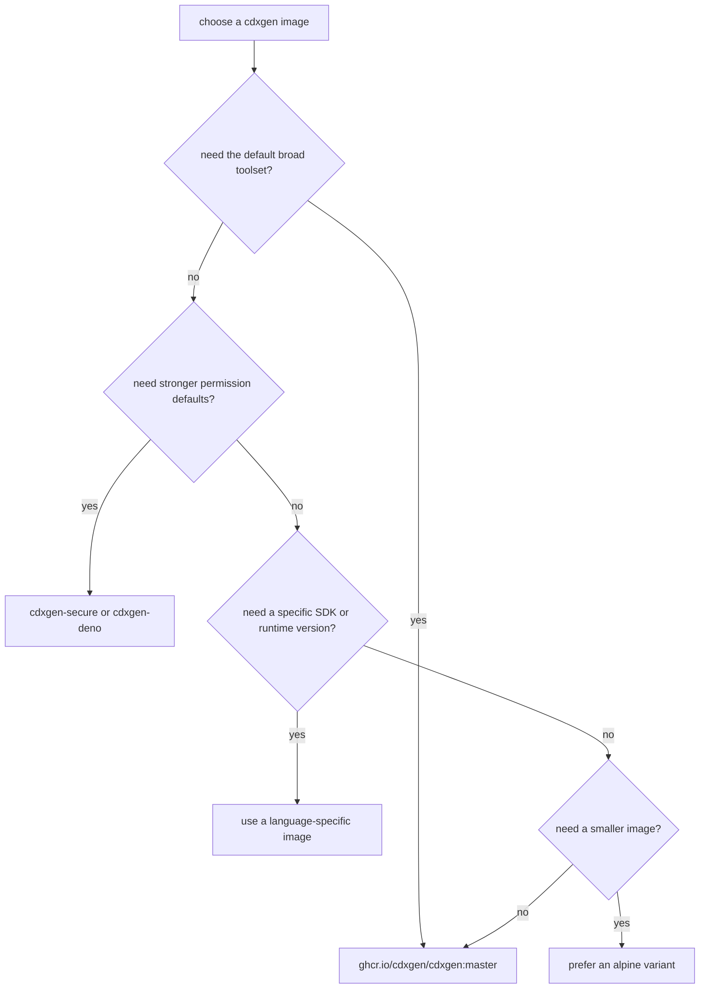

# Advanced Usage

## Include pattern

cdxgen uses the default set of glob patterns to locate language-specific package manifests and lock files. To customise these patterns, use the argument `--include-regex`.

Example:

Parse only the pyproject.toml files present in directories ending with google.

```shell
--include-regex "**/*google/pyproject.toml"
```

Parse only the requirements.txt files present in directories ending with nvidia.

```shell
--include-regex "**/*nvidia/requirements.txt"
```

Combine this with `--exclude`, `--exclude-type`, and other filters to customise the exact set of manifests and lock files used for the generated BOM.

## Exclude project types, files, and directories

To exclude specific [project types](https://cdxgen.github.io/cdxgen/#/PROJECT_TYPES) from the BOM, use the `--exclude-type` argument. Multiple values are allowed.

Example:

Generate an SBOM for all types except js

```shell
--exclude-type js
```

Generate an SBOM for all types except github and dotnet

```shell
--exclude-type github --exclude-type dotnet
```

Generate a JavaScript SBOM but drop shipped AI skill files and MCP config artifacts:

```shell
cdxgen -t js --exclude-type ai-skill --exclude-type mcp
```

Use the argument `--exclude` to provide a glob pattern for files and directories to exclude from the BOM. Multiple values are allowed.

Example:

Exclude quickstarts directory.

```shell
--exclude "**/quickstarts/**"
```

Brace expansion is supported. `{openshift,kubernetes}-maven-plugin` in the below example, expands to `openshift-maven-plugin` and `kubernetes-maven-plugin`.

```shell
--exclude "**/quickstarts/**" --exclude "**/{openshift,kubernetes}-maven-plugin/**"
```

### Excluding packages using package manager configuration

Some package managers support filtering dependencies. For example, maven `dependency:tree` command supports [filtering](https://maven.apache.org/plugins/maven-dependency-plugin/examples/filtering-the-dependency-tree.html). It is possible to use some of the existing [environment variables](./ENV.md) to utilize these features.

Java maven example:

```shell
export MVN_ARGS="-Dexcludes=:::*-SNAPSHOT"
```

Gradle example:

```shell
export GRADLE_ARGS="--configuration runtimeClasspath"
```

## Filtering components

cdxgen can filter the components and the dependency tree before writing to a BOM json file. Three kinds of filters are allowed:

### Required only filter

Pass `--required-only` to only store components with the `scope` attribute set to `required`. These are usually considered direct dependencies.

```shell
cdxgen -t java -o /tmp/bom.json -p --required-only
```

Languages supported:

- Java with Maven
- Node.js
- Go
- Php

### Purl and properties filter

Use `--filter` to filter components containing the string in the purl or components.properties.value. Since the purl string includes the namespace (group), you can use this argument as a namespace filter too. Filters are case-insensitive.

Example 1: Filter all "springframework" packages (purl or namespace)

```shell
cdxgen -t java -o /tmp/bom.json -p --filter org.springframework
```

Example 2: Filter components belonging to the gradle profile "debugAndroidTestCompileClasspath" or "debugRuntimeClasspath"

```shell
cdxgen -t gradle -o /tmp/bom.json -p --filter debugAndroidTestCompileClasspath --filter debugRuntimeClasspath
```

### Include only filter

Use `--only` to include only those components containing the string in the purl. This can be used to generate BOM with "first party" components only.

```shell
cdxgen -t java -o /tmp/bom.json -p --only org.springframework
```

### Minimum confidence filter

Use `--min-confidence` with a value between 0 and 1 to filter components based on the confidence of their purl [identify](https://cyclonedx.org/docs/1.6/json/#components_items_evidence_identity_oneOf_i0_items_field). The logic involves looking for `field=purl` in `evidence.identity` and collecting the maximum `confidence` value. This is then compared against the minimum confidence passed as an argument.

```shell
cdxgen -t c . --min-confidence 0.1
```

The above would filter out all the zero confidence components in c/c++, so use it with caution.

### Analysis technique filter

Use `--technique` to list the techniques that cdxgen is allowed to use for the xBOM generation. Leaving this argument or using the value `auto` enables default behaviour.

Example 1 - only allow manifest-analysis:

```shell
cdxgen -t c . --technique manifest-analysis
```

Example 2 - allow manifest-analysis and source-code-analysis:

```shell
cdxgen -t c . --technique manifest-analysis --technique source-code-analysis
```

List of supported techniques:

- auto (default)
- source-code-analysis
- binary-analysis
- manifest-analysis
- hash-comparison
- instrumentation
- filename

Currently, this capability is implemented as a filter during post-processing, so unlikely to yield any performance benefits.

### Component type filter

Use `--component-type` to include only selected CycloneDX component types in the generated BOM. The option is repeatable and is validated against the selected `--spec-version` before scanning starts. Leaving this argument unset preserves the default behaviour.

This option is a filter, not an inventory enabler. It cannot make cdxgen generate component classes that are not implemented for the selected project type. For example, passing `--component-type machine-learning-model` does not enable machine-learning model discovery; if the scan would not otherwise produce machine-learning model components, filtering to that type can result in an empty component list.

Example - include only libraries and frameworks:

```shell
cdxgen -t docker alpine:3.20 --component-type library --component-type framework
```

The accepted values depend on the CycloneDX spec version:

- `1.4`: `application`, `framework`, `library`, `container`, `operating-system`, `device`, `firmware`, `file`
- `1.5`: all `1.4` values plus `platform`, `device-driver`, `machine-learning-model`, `data`
- `1.6`, `1.7`, and `2.0`: all `1.5` values plus `cryptographic-asset`

For example, `--spec-version 1.5 --component-type cryptographic-asset` is rejected early because CycloneDX 1.5 does not define `cryptographic-asset`. When older spec versions are requested, cdxgen also removes component types unsupported by that schema during post-processing so generated BOMs remain schema-valid.

The dedicated `cbom` command does not accept `--component-type`; use `cdxgen --include-crypto` instead when you need normal SBOM generation plus component-type filtering.

### Traffic Light Protocol classification

Use `--tlp-classification` to record a [Traffic Light Protocol (TLP)](https://www.first.org/tlp/) classification under `metadata.distributionConstraints.tlp`. This field is defined by CycloneDX 1.7 and above; cdxgen omits it when downgrading to 1.6 or earlier so the generated document stays schema-valid.

The accepted values match the CycloneDX 1.7 `tlpClassification` enum exactly: `CLEAR`, `GREEN`, `AMBER`, `AMBER_AND_STRICT`, `RED`.

```shell
cdxgen -t npm . --spec-version 1.7 --tlp-classification AMBER
```

When the classification is weak (`CLEAR`, `GREEN`, or `AMBER`), cdxgen redacts known sensitive property values (credentials, bearer tokens, signed URL parameters, and the `cdx:mcp:*` command/endpoint fields) before emitting the BOM, because a weakly-scoped document must not carry material that could be redistributed unintentionally. `AMBER_AND_STRICT` and `RED` preserve those values.

## PEP 770 embedded SBOMs (Python)

[PEP 770](https://peps.python.org/pep-0770/) (Final, 2025) lets a Python distribution carry one or more SBOM documents in a reserved `<dist>.dist-info/sboms/` directory. There is no metadata field — presence in the directory is the sole signal — and both CycloneDX and SPDX are permitted.

cdxgen discovers embedded SBOMs in installed distributions (`site-packages/<dist>.dist-info/sboms/*`) and inside wheels, and merges them into the Python BOM:

- Bundled components become **dependencies of the distribution that supplied them**, never orphan top-level siblings. The embedded dependency graph is preserved.
- An embedded SBOM is a stronger assertion than cdxgen's inference, so on conflict the embedded component wins; the merge records rather than discards.
- Ecosystems cdxgen does not otherwise handle (C libraries, `generic` purls) are passed through faithfully.
- Each embedded component carries `cdx:embeddedSbom:source` (the distribution name) and `cdx:embeddedSbom:format` (`cyclonedx-1.5`, `spdx-2.3`, …), and a CycloneDX 1.7 citation attributes them to the distribution component that declared them, naming PEP 770 as the provenance.

The embedded data is untrusted third-party input: cdxgen bounds its size (documents larger than 5 MiB are skipped), never follows references out of it, validates the shape before merging, and skips an invalid document with a warning rather than failing the run.

## TEA — Transparency Exchange API

The [Transparency Exchange API](https://github.com/CycloneDX/transparency-exchange-api) (ECMA TC54 TG1) is a standard for exchanging transparency artefacts (SBOMs, VEX, attestations) between systems. The consumer API is the current conformance base (spec version 0.4.0); the publisher API exists as a **draft recommendation** in `spec/publisher/` and is subject to change.

### Fetching upstream SBOMs (`--tea-fetch`)

```bash
cdxgen -t js /path/to/repo --tea-fetch urn:tei:uuid:cdxgen.github.io:d4d9f54a-abcf-11ee-ac79-1a52914d44b1
```

cdxgen resolves the TEI via `/.well-known/tea` discovery (HTTPS only, per the spec), selects the endpoint with the highest matching API version and priority, resolves the TEI to a product release, downloads the latest Collection's BOM artifacts, and merges the upstream components into the generated BOM. Fetched components are tagged `cdx:tea:source` / `cdx:tea:collection` and carry a CycloneDX 1.7 citation. The merge uses the same rule as PEP 770: the upstream document is a stronger assertion than cdxgen's inference, so it wins on conflict and the conflict is recorded rather than discarded. A fetch failure only warns — the locally generated BOM stands.

Every checksum a Collection declares must match, and an artifact whose checksums all use algorithms this client cannot compute is rejected rather than merged unverified: remote content whose integrity was asserted and then not checked is worse than fetching nothing. An artifact that declares no checksum at all is a publisher decision, and is merged with a warning. Documents over 5 MiB are skipped, as with PEP 770.

### Publishing (`--tea-publish`)

```bash
cdxgen -t js /path/to/repo -o bom.json \
  --tea-publish https://cdxgen.github.io/tea \
  --tea-leaf-identifier 123e4567-e89b-12d3-a456-426614174000 \
  --tea-author-name "Jane Doe" \
  --tea-artifact-url https://cdxgen.github.io/downloads/bom.json
```

The generated BOM is published as a TEA Artifact in a Collection via the draft publisher API's `POST /collection`. Collection versioning is owned by the server: publish the first collection with the default `--tea-reason INITIAL_RELEASE`, and subsequent updates with `ARTIFACT_UPDATED`, `ARTIFACT_ADDED`, `ARTIFACT_REMOVED`, or `VEX_UPDATED`; the server increments the collection version.

- The BOM is written locally **before** the publish attempt, so a publish failure never costs you your SBOM; the failure is reported and cdxgen exits with status `3` (distinct from other errors).
- Credentials (`--tea-token` or `TEA_TOKEN`) are sent only as an `Authorization: Bearer` header, are never logged, and never reach the BOM.
- `--tea-artifact-url` must be reachable by the TEA server; by default cdxgen uses the local output path, which most servers cannot fetch.

## Go Evinse data-flow and crypto-flow evidence

For Go projects, generate the base SBOM first and then enrich it with `evinse -l go`. The Go Evinse path uses the optional `golem` helper from `@cdxgen/cdxgen-plugins-bin` to attach occurrence evidence, call-stack frames, usage scopes, security signals, crypto components, and data-flow/crypto-flow properties.

Routine semantic evidence:

```shell
cdxgen -t go -o bom.json /absolute/path/to/go/project
evinse -i bom.json -o bom.evinse.json -l go --golem-callgraph static /absolute/path/to/go/project
```

Bounded data-flow and crypto-flow evidence:

```shell
evinse -i bom.json -o bom.evinse.json -l go \
  --with-data-flow \
  --golem-dataflow crypto \
  --golem-dataflow-pattern-packs crypto \
  /absolute/path/to/go/project
```

`--deep` enables the same Golem data-flow collection with performance safeguards. cdxgen caps worker count and `GOMAXPROCS`, applies slice and trace limits, skips generated files by default, and skips tests unless `--golem-tests` is supplied. Use `--golem-memory-limit 4GiB`, narrower `--golem-patterns`, or `--golem-dataflow crypto` when a large repository needs predictable CI runtime.

The enriched BOM uses `cdx:golem:*` properties. High-value pivots include `cdx:golem:dataFlowMode`, `cdx:golem:dataFlowSliceCount`, `cdx:golem:cryptoDataFlow`, `cdx:golem:cryptoDataFlowCount`, `cdx:golem:cryptoAlgorithms`, `cdx:golem:usageScopes`, `cdx:golem:securitySignalSeverity`, `cdx:golem:localReplacement`, and `cdx:golem:vendored`. Rendered crypto components are `type: "cryptographic-asset"` and intentionally do not have purls.

After enrichment, run the focused audit and inspect interactively:

```shell
cdx-audit --bom bom.evinse.json --direct-bom-audit --categories golem
cdxi bom.evinse.json
```

## Automatic compositions

When using any filters, cdxgen would automatically set the [compositions.aggregate](https://cyclonedx.org/docs/1.5/json/#compositions_items_aggregate) property to "incomplete" or "incomplete_first_party_only".

To disable this behavior, pass `--no-auto-compositions`.

## Build fidelity rules

The `build-fidelity` rule pack (`data/rules/build-fidelity.yaml`) reviews a
finished BOM for signs that it does not faithfully represent the project's real
dependency set: a resolver that never ran, a lockfile that was ignored, or
components missing the coordinates a healthy scan produces.

Key facts about the pack:

- It is **not** part of a default `--bom-audit` run. The category only activates
  when explicitly requested with `--bom-audit-categories build-fidelity` or
  through the `--introspect` reflection step, which is its primary consumer.
- Every rule reads only BOM structure, so all rules support dry runs in full.
- Each rule names the fidelity `tier-signal` it demotes the ecosystem to:
  `resolved` (resolver ran) > `lockfile` (complete lockfile read) >
  `manifest` (declared dependencies only) > `heuristic` (inferred from
  artifacts) > `absent` (markers found, nothing produced).
- Rules declare `applies-to` (a list of purl types) so that ecosystems with no
  resolver cdxgen can drive stay silent. BOMs from unsupported project types
  and container/rootfs inventories are never fidelity findings.

| Rule           | Fires when                                                                          | Tier signal |
| -------------- | ----------------------------------------------------------------------------------- | ----------- |
| `BF-GEN-001`   | More than half of the components appear nowhere in `dependencies[]`                 | `manifest`  |
| `BF-GEN-002`   | More than 20% of components have no version                                         | `heuristic` |
| `BF-GEN-003`   | More than 10% of package components have no purl                                    | `heuristic` |
| `BF-GEN-004`   | No component carries a hash or identity evidence in npm/cargo scans                 | `heuristic` |
| `BF-GEN-005`   | `metadata.lifecycles` claims `post-build` but no component has evidence             | `manifest`  |
| `BF-GEN-006`   | A supported ecosystem's BOM has zero components (typed parent purl)                 | `absent`    |
| `BF-GEN-007`   | 10+ dependency nodes but at most one carries `dependsOn` entries                    | `manifest`  |
| `BF-JVM-001`   | `pkg:maven` components exist with no dependency graph (pom.xml fallback)            | `manifest`  |
| `BF-JVM-002`   | Maven graph holds fewer than half as many edges as maven components                 | `manifest`  |
| `BF-JVM-003`   | Maven BOM built from jar scanning only (no evidence, hashes, or graph)              | `heuristic` |
| `BF-JVM-004`   | `cdx:gradle:GradleRootPath` marker present but no `pkg:maven` components            | `absent`    |
| `BF-JS-001`    | `pkg:npm` components exist but none carries an integrity hash                       | `manifest`  |
| `BF-JS-002`    | More than half of `pkg:npm` components have range versions (`^`, `~`, `>`, `*`)     | `manifest`  |
| `BF-JS-003`    | `cdx:npm:isWorkspace` marker with at most one dependency node                       | `manifest`  |
| `BF-PY-001`    | `pkg:pypi` components are referenced by no dependency node                          | `manifest`  |
| `BF-PY-002`    | `pkg:pypi` components with no hashes, no graph position, and no provenance property | `manifest`  |
| `BF-PY-003`    | More than 20% of `pkg:pypi` components have range or absent versions                | `heuristic` |
| `BF-GO-001`    | `pkg:golang` components in a graph where no node has `dependsOn` entries            | `manifest`  |
| `BF-RB-001`    | `pkg:gem` components in a graph where no node has `dependsOn` entries               | `manifest`  |
| `BF-RS-001`    | `pkg:cargo` components in a graph where no node has `dependsOn` entries             | `manifest`  |
| `BF-CS-001`    | `pkg:nuget` components in a graph where no node has `dependsOn` entries             | `manifest`  |
| `BF-SWIFT-001` | `pkg:swift` components with no dependency graph (ceiling shape)                     | `lockfile`  |

The generic coverage threshold (50%) and the scoped rules were calibrated
against measured BOM pairs; the thresholds and their measuring notes live as
comments in `data/rules/build-fidelity.yaml`.

## Build introspection

The build-fidelity rules are one input of build introspection, the feature
that turns them into a verdict. Run with `--introspect` (or
`--profile introspect`, or `CDXGEN_INTROSPECT=true`) and cdxgen joins three
evidence sources — the build ledger it recorded during the run, the
build-fidelity rule findings, and the ecosystem markers it finds on disk —
into a per-ecosystem fidelity verdict, an overall score, and a ranked list of
remediations. Introspection measures the environment the user actually has: it
never installs dependencies and never implies `--bom-audit`. The full feature
page — tiers, report anatomy, the agent loop, and a worked degraded-to-repaired
transition with both real reports — lives in
[docs/INTROSPECTION.md](./INTROSPECTION.md).

A degraded run looks like this:

```shell
$ MVN_CMD=/nonexistent/mvn cdxgen -t java --introspect -o bom.json .
Build introspection: overall manifest (45/100), confidence high
Build introspection: 3 remediation(s) ranked
Build introspection: markdown report: bom.json.introspection.md
Build introspection: json report: bom.json.introspection.json
```

The markdown report names what is missing, ranks the fixes by expected score
gain, and reproduces the exact invocation:

````markdown
# cdxgen build introspection

Overall: manifest (45/100) — the SBOM is missing transitive dependencies for java; 2 remediation(s) proposed.

## What to fix

### 1. Maven build failed; only the direct dependencies declared in pom.xml were captured

- Remediation: `jvm.maven.manifest-fallback` (source: ledger) — ecosystem: `java`, confidence: high
- Score: 45 → 100 (tier `resolved`); expected overall gain: +55.00
- Also resolves: `BF-JVM-001`

POSIX:

```sh
sdk install java {{version}}
sdk install maven {{version}}
mvn -q package -DskipTests
```
````

The fix is in the agent's or developer's hands, not cdxgen's: build the
project (or let `--install-deps` drive the resolver), then re-run. The report
ends with the original invocation, so the improved re-run is a copy-paste:

```shell
$ cdxgen -t java --no-install-deps -o bom.json . --introspect
Build introspection: overall resolved (100/100), confidence high
Build introspection: 0 remediation(s) ranked
```

Because the inputs fingerprint in the report moves only when the resolved
toolchain moves, an automation loop can diff consecutive JSON reports to prove
the fix took effect instead of trusting the exit status.

The verdict also travels inside the BOM: eight `cdx:introspection:*` metadata
properties plus document-level annotations (one summary, one per actionable
remediation), documented in `docs/CUSTOM_PROPERTIES.md`. Pass
`--no-introspect-annotate` to keep the BOM untouched. When the report matters
more than the BOM, the CI gate `--introspect-fail-below <n>` exits with
status 4 after the BOM is written if the overall score is below the threshold;
see `docs/CLI.md`.

## Output streams and log discipline

cdxgen follows a strict stream contract:

- **stdout** carries the payload only — the BOM document when no `-o` file is
  given, or when you use `-o -` to write the BOM to stdout.
- **stderr** carries every diagnostic: progress, banners, warnings, the
  environment audit table, audit findings, and debug/trace logs.

This keeps stdout machine-parseable. To write the BOM directly to stdout (for
piping into another tool), use:

```bash
cdxgen -t js -o - . | jq '.components | length'
```

### Verbosity and progress flags

| Flag                          | Env equivalent                                      | Effect                                                  |
| ----------------------------- | --------------------------------------------------- | ------------------------------------------------------- |
| `-q`, `--quiet`               | `CDXGEN_LOG_LEVEL=silent`                           | Errors only                                             |
| `--verbose`                   | `CDXGEN_LOG_LEVEL=verbose`                          | + per-file/per-manifest detail                          |
| `--verbose --verbose`         | `CDXGEN_LOG_LEVEL=debug`, `CDXGEN_DEBUG_MODE=debug` | + debug output                                          |
| `--no-progress`               | `CDXGEN_NO_PROGRESS=true`                           | Force static (non-animated) output                      |
| `--color=always\|never\|auto` | `CDXGEN_COLOR`, `NO_COLOR`, `FORCE_COLOR`           | Color control                                           |
| `--log-format=json`           | `CDXGEN_LOG_FORMAT=json`                            | NDJSON records to stderr; disables the live region      |
|                               | `CDXGEN_UNICODE=false`                              | Use ASCII markers and spinner instead of unicode glyphs |

When both a flag and its env equivalent are set, the **env var wins** so
existing CI configurations keep working unchanged.

`-v` prints the version, unchanged from v12. `--verbose` therefore has no short
form; repeat the long flag or set `CDXGEN_LOG_LEVEL=debug`.

The live progress region animates only when stderr is an interactive terminal.
Under a pipe or redirect, with `CI=true`, when `TERM` is `dumb` or `unknown`, in
server mode, inside worker threads, or with `--no-progress`, each phase emits a
single static summary line and no ANSI escape byte is written.

Unicode glyphs (the braille spinner and the `✔`/`✖`/`→` markers) are used
everywhere except legacy Windows consoles, which are detected by the absence of
`WT_SESSION`. Set `CDXGEN_UNICODE=true` or `false` to override the guess.

## Purl source resolution

cdxgen can accept a package URL (`pkg:*`) as the input path and automatically resolve it to a cloneable repository URL.

Supported purl types for automatic git URL detection:

- `pkg:npm/...` (registry metadata lookup)
- `pkg:pypi/...` (registry metadata lookup)
- `pkg:gem/...` (registry metadata lookup)
- `pkg:cargo/...` (registry metadata lookup)
- `pkg:pub/...` (registry metadata lookup)
- `pkg:github/...` (direct repository mapping)
- `pkg:bitbucket/...` (direct repository mapping)
- `pkg:maven/...` (POM `scm` metadata lookup; version required)
- `pkg:composer/...` (Packagist metadata lookup)
- `pkg:generic/...` (requires `vcs_url` or `download_url` qualifier)

Examples:

```shell
cdxgen -t js -o bom.json "pkg:npm/lodash@4.17.21"
cdxgen -t js -o bom.json "pkg:generic/example@1.0.0?vcs_url=git+https://github.com/cdxgen/cdxgen.git"
```

Unsupported or malformed purl source types fail fast with explicit validation errors in both CLI and server mode.

## Configuration files

Tired of passing command line arguments to cdxgen?

JSON format

- .cdxgenrc
- .cdxgen.json

YAML format

- .cdxgen.yml
- .cdxgen.yaml

Examples:

```json
{
  "type": "java",
  "print": true,
  "output": "bom.json"
}
```

```yaml
# Java type
type: java
# Print the BOM as table and tree
print: true
# Set the output file
output: bom.json
# Only include these components in the BOM
only: org.springframework
```

### Environment variables

All command line arguments can also be passed as environment variables using the "CDXGEN\_" prefix.

```shell
export CDXGEN_TYPE=java
export CDXGEN_PROJECT_NAME=foo
```

Environment variables override values from the configuration files.

### Config value ordering

- Command-line arguments
- Environment variables
- Configuration files (JSON first, followed by yaml)

## Evinse Mode / SaaSBOM

Evinse (Evinse Verification Is Nearly SBOM Evidence) generates component evidence and SaaSBOM data for supported languages. The tool is powered by [atom](https://github.com/AppThreat/atom) for Java, JavaScript, TypeScript, Python, and C/C++ flows, by [dosai](https://github.com/owasp-dep-scan/dosai) for .NET flows, and by `golem` for Go semantic evidence. cdxgen also supports `--evidence` during BOM generation. This section focuses on direct `evinse` usage for advanced workflows. See [`EVINSE.md`](EVINSE.md) for the dedicated command guide.


### Pre-requisites

- Java > 21 installed
- Application source code
- Input SBOM in CycloneDX >1.5 format. Use cdxgen to generate one.

### Usage

```shell
evinse -h
Options:
  -i, --input                    Input SBOM file. Default bom.json
                                                           [default: "bom.json"]
  -o, --output                   Output file. Default bom.evinse.json
                                                    [default: "bom.evinse.json"]
  -l, --language                 Application language
  [choices: "java", "jar", "javascript", "python", "android", "cpp"] [default: "
                                                                          java"]
      --force                    Force creation of the database
                                                      [boolean] [default: false]
      --skip-maven-collector     Skip collecting jars from maven and gradle cach
                                 es. Can speedup re-runs if the data was cached
                                 previously.          [boolean] [default: false]
      --with-deep-jar-collector  Enable collection of all jars from maven cache
                                 directory. Useful to improve the recall for cal
                                 lstack evidence.     [boolean] [default: false]
      --annotate                 Include contents of atom slices as annotations
                                                      [boolean] [default: false]
      --with-data-flow           Enable inter-procedural data-flow slicing.
                                                      [boolean] [default: false]
      --with-reachables          Enable auto-tagged reachable slicing. Requires
                                 SBOM generated with --deep mode.
                                                      [boolean] [default: false]
      --exclude, --exclude-regex Additional glob pattern(s) to ignore during
                                 Atom evidence generation.          [array]
      --usages-slices-file       Use an existing usages slices file.
                                                 [default: "usages.slices.json"]
      --data-flow-slices-file    Use an existing data-flow slices file.
                                              [default: "data-flow.slices.json"]
      --reachables-slices-file   Use an existing reachables slices file.
                                             [default: "reachables.slices.json"]
  -p, --print                    Print the evidences as table          [boolean]
      --version                  Show version number                   [boolean]
  -h                             Show help                             [boolean]
```

To generate an SBOM with evidence for a java project.

```shell
evinse -i bom.json -o bom.evinse.json <path to the application>
```

By default, only occurrence evidence is determined by creating usages slices. To generate callstack evidence, pass either `--with-data-flow` or `--with-reachables`.

#### Reachability-based call stack evidence

atom supports reachability-based evidence generation for Java, JavaScript, and TypeScript applications. Reachability refers to data flows that originate from entry points (sources) ending at a sink (which are invocations to external libraries). The technique used is called "Forward-Reachability".

Two necessary prerequisites for this slicing mode are that the input SBOM must be generated with cdxgen and in deep mode (only for java, jars, python type) and must be placed within the application directory.

```shell
cd <path to the application>
cdxgen -t java --deep -o bom.json --evidence .
```

```shell
cd <path to the application>
cdxgen -t python --deep -o bom.json --evidence .
```

For JavaScript and TypeScript applications, deep mode is optional.

```shell
cd <path to the application>
cdxgen -t js -o bom.json .
evinse -i bom.json -o bom.evinse.json -l js --with-reachables .
```

#### Data flow-based call stack evidence

Often reachability cannot be computed reliably due to the presence of wrapper libraries or mitigating layers. Further, the repository being analyzed could be a common module containing only the sink methods without entry points (sources). In such cases, data-flow-based slicing can be used to compute call stack using a "Reverse-Reachability" algorithm. This is however a time and resource-consuming operation and might even require atom to be run externally in [java mode](https://cdxgen.github.io/cdxgen/#/ADVANCED?id=use-atom-in-java-mode).

```shell
evinse -i bom.json -o bom.evinse.json --with-data-flow <path to the application>
```

#### Performance tuning

To improve performance, you can cache the generated usages and data-flow slices file along with the bom file.

```shell
evinse -i bom.json -o bom.evinse.json --usages-slices-file usages.json --data-flow-slices-file data-flow.json --with-data-flow <path to the application>
```

#### Other languages

For .NET projects, generate the input BOM in deep mode so dosai can add source-backed occurrence evidence and API endpoint services. Use `--profile research` when you also want dosai data-flow call stacks and crypto analysis.

```shell
cdxgen -t dotnet --deep --evidence -o bom.json <path to the application>
evinse -i bom.json -o bom.evinse.json -l dotnet --profile research <path to the application>
```

dosai-derived services are sanitized before being written to the BOM. cdxgen strips URL credentials, query strings, and fragments, and emits authorization policy and role counts rather than raw policy or role values.

For JavaScript or TypeScript projects, pass `-l javascript`.

```shell
evinse -i bom.json -o bom.evinse.json --usages-slices-file usages.json --data-flow-slices-file data-flow.json -l javascript --with-data-flow <path to the application>
```

For Go projects, generate the base BOM first and then run `evinse -l go`. When the optional `golem` binary is available from `@cdxgen/cdxgen-plugins-bin`, Evinse maps Go module inventory to semantic source evidence.

```shell
cdxgen -t go -o bom.json <path to the application>
evinse -i bom.json -o bom.evinse.json -l go --golem-callgraph static <path to the application>
```

Golem adds occurrence and call-stack evidence plus `cdx:golem:*` properties for usage scopes, occurrence kinds, security signals, local replacements, vendoring, private module candidates, license-file evidence, build directives, generated files, native artifacts, and Go toolchain directives.

Use `--golem-callgraph static` for normal CI, and use `rta` or `vta` for more precise root-based call graph evidence where higher runtime and memory use are acceptable. Use `--golem-tags` when build tags change the reachable packages, and `--golem-tests` when test-only dependency use is part of the review.

After enrichment, import the BOM into `cdxi` and use `.golemsummary`, `.golemhotspots`, `.golemcoverage`, `.occurrences`, and `.callstack`. To audit the Golem properties, run `cdx-audit --bom bom.evinse.json --direct-bom-audit --categories golem`.

See [Go Evinse with Golem](GO_EVINSE_GOLEM.md), [the Go Evinse threat model](GO_EVINSE_GOLEM_THREAT_MODEL.md), and [the Go Evinse tutorial](LESSON14.md) for the complete workflow.

#### Excluding source paths from Atom evidence

When cdxgen or evinse invokes atom to create occurrence, reachability, or data-flow evidence, `--exclude` glob patterns are converted to Scala/Java-compatible regular expressions and applied to Atom evidence. Directory fragments are also forwarded through `CHEN_IGNORE_DIRS`, which Atom applies across supported frontends. For JavaScript and TypeScript, the same directory fragments are forwarded through `ASTGEN_IGNORE_DIRS` to improve astgen traversal performance.

```shell
cdxgen -t js --profile research --exclude "**/fixtures/**" --exclude "**/*.spec.js" -o bom.json <path to the application>
```

The same behavior applies when running evinse directly:

```shell
evinse -i bom.json -o bom.evinse.json -l javascript --exclude "**/fixtures/**" <path to the application>
```

This prevents excluded source files and directories from contributing package usage and occurrence evidence. cdxgen extracts stable literal directory fragments from excludes such as `**/fixtures/**` and merges them with any existing `CHEN_IGNORE_DIRS` value before invoking Atom. For JavaScript and TypeScript projects, directory fragments are also merged with `ASTGEN_IGNORE_DIRS`; full glob patterns such as `**/*.spec.js` are converted to regular expressions for evidence filtering.

For Python with cached usages and reachables file.

```shell
evinse -i bom.json -o bom.evinse.json --usages-slices-file usages.json --reachables-slices-file reachables.json -l python --with-reachables <path to the application>
```

## Generate SBOM from maven or gradle cache

There could be Java applications with complex dependency requirements. Or you might be interested in cataloging your Maven or gradle cache.
A bonus of this mode is that the resulting SBOM would have a property called `internal:Namespaces` with a list of class names belonging to each jar.

### Generate evidence of usage

After generating an SBOM from a cache, you can look for evidence of direct usage with evinse.

```shell
# compile or build your application
evinse -i <bom from cache> -o bom.evinse.json <application path>
# Generate data-flow evidence (Takes a while)
# evinse -i <bom from cache> -o bom.evinse.json --with-data-flow <application path>
```

Evinse would populate `component.evidence` objects with occurrences (default) and call stack (in data-flow mode). Those without evidence are either transitive or unused dependencies.

## Mixed Java Projects

If a java project uses maven and gradle, maven is selected for SBOM generation under default settings. To force cdxgen to use gradle, use the argument `-t gradle`. Similarly, use `-t scala` for scala SBT.

## Generating container SBOM on Windows

cdxgen supports generating container SBOM for Linux images on Windows. Follow the steps listed below.

- Ensure cdxgen-plugins-bin >= 2.2.0 is installed.

```shell
npm install -g @cdxgen/cdxgen-plugins-bin
```

- Run "Docker for Desktop" as an administrator with the 'Exposing daemon on TCP without TLS' setting turned on.
  Run Powershell terminal as administrator. Without this, cdxgen would fail while extracting symlinks.
- Invoke cdxgen with `-t docker`

```shell
cdxgen -t docker -o bom.json <image name>
```

## Generate SBOM with evidence for the cdxgen repo

Why not?

```shell
cdxgen -t php -t js -t jar -t ruby --exclude "**/test/**" -o bom.json
evinse -i bom.json -o bom.evinse.json -l javascript

# Don't be surprised to see the service endpoint offered by cdxgen!
# Review the reachables.slices.json and file any vulnerabilities or bugs!
```

## Use Atom in Java mode

For large projects (> 1 million lines of code), atom must be invoked separately for the slicing operation. Follow the instructions below.

- Download the latest [atom.zip release](https://github.com/AppThreat/atom/releases)

```shell
unzip atom.zip
cd atom-1.0.0/bin

# Java project
./atom -J-Xmx16g usages -o app.atom --slice-outfile usages.json -l java <path to repo>

# C project
./atom -J-Xmx16g usages -o app.atom --slice-outfile usages.json -l c <path to repo>

node bin/cdxgen.js -o bom.json -t c --usages-slices-file usages.json <path to repo>
```

Change 16g to 32g or above for very large projects. For the Linux kernel, a minimum of 128GB is required.

## Customize metadata.authors in BOM

Use the argument `--author` to override the author name. Use double quotes when the name includes spaces. Multiple values are allowed.

```
cdxgen --author "OWASP Foundation" --author "Apache Foundation" -t java ...
```

## Generate bash/zsh command completions

Run the commands such as cdxgen, evinse, etc with completion as the argument.

```shell
cdxgen completion >> ~/.zshrc

# cdxgen completion >> ~/.bashrc

# evinse completion >> ~/.zshrc
```

## BOM Profile

With profiles, cdxgen can generate a BOM that is optimized for a specific use case or purpose. The default is `generic`.

| Profile            | Purpose                                                                   | Configurations enabled                 |
| ------------------ | ------------------------------------------------------------------------- | -------------------------------------- |
| appsec             | BOM will be consumed by application security for vulnerability management | Enable deep mode                       |
| research           | BOM for security research                                                 | Enables deep and evidence mode         |
| operational        | Generate OBOM                                                             | projectType set to os                  |
| license-compliance | Fetch license data                                                        | Set FETCH_LICENSE environment variable |

## BOM lifecycles

By default, cdxgen attempts to generate a BOM for the `build` lifecycle [phase](https://cyclonedx.org/docs/1.5/json/#tab-pane_metadata_lifecycles_items_oneOf_i0) for applications and `post-build` phase for container images. Using the argument, `--no-install-deps` it is possible to generate `pre-build` BOM for certain languages and ecosystems (Eg: Python) by disabling the package installation feature. Or explicitly pass `--lifecycle post-build` to generate an SBOM for android, dotnet, and go binaries.

Example:

```shell
cdxgen -t android --lifecycle post-build -o bom.json <path to apks>
```

```shell
cdxgen -t dotnet --lifecycle post-build -o bom.json <path to dotnet binaries>
```

```shell
cdxgen -t go --lifecycle post-build -o bom.json <path to go binaries>
```

## Legacy dotnet and Java projects

To obtain transitive dependencies and a complete dependency tree for dotnet projects, `dotnet restore` command needs to be executed. Recent versions of cdxgen would attempt to restore all the solution and .csproj files when there are no `project.assets.json` files found.

This, however, requires the correct version of dotnet SDK to be installed. The official container image bundles version 8.0 of the SDK.

```shell
docker run --rm -v /tmp:/tmp -v $(pwd):/app:rw -it ghcr.io/cdxgen/cdxgen -r /app -o bom.json -t dotnet
```

If the project requires a different version of the SDK, such as .Net core 3.1 or dotnet 6.0, then try with the below custom [images](https://github.com/cdxgen/cdxgen/ci/base-images).

```shell
docker run --rm -v /tmp:/tmp -v $(pwd):/app:rw -it ghcr.io/cdxgen/cdxgen-dotnet:v13 -r /app -o bom.json -t dotnet
```

If the project requires legacy frameworks such as .Net Framework 4.6/4.7, then a Windows operating system or container is required to generate the SBOM correctly. A workaround is to commit the project.assets.json and the lock files to the repository from Windows and run cdxgen from Linux as normal.

For Java projects that require a specific runtime, use the custom images `ghcr.io/cdxgen/cdxgen-java11:v13` (Java 11) or `ghcr.io/cdxgen/cdxgen-java17:v13` (Java 17). Alternatively, use Java version aliases via CLI as shown.

```shell
cdxgen -t java11
cdxgen -t java17
cdxgen -t java25
cdxgen -t java26
```

[sdkman](https://sdkman.io) must be installed and setup for these arguments to work.

### Pinning JVM build tools

The JVM build tools themselves can be pinned the same way by appending an sdkman version to the tool type. cdxgen installs exactly that version with sdkman, sets `MAVEN_HOME`/`GRADLE_HOME`/`SBT_HOME` plus the matching command variables, and uses it for dependency resolution — overriding any wrapper scripts the project may contain.

```shell
cdxgen -t maven3.9.9 -t java17     # Maven 3.9.9 plus a Temurin 17 JDK
cdxgen -t gradle8.14               # resolves the newest stable 8.14.x
cdxgen -t sbt1.10.11
cdxgen -t scala3.6.4
```

Version identifiers must be exact sdkman identifiers (see `sdk list maven`), except that a partial prefix such as `maven3.9` is resolved to the newest stable matching release. A compatible JDK is derived automatically from the tool requirements (Maven 4 and Gradle 9 need Java 17+, for example) and provisioned first when the current Java is older. When no JDK type is passed, cdxgen defaults to Java 21. `MAVEN_TOOL`, `GRADLE_TOOL`, `SBT_TOOL`, and `SCALA_TOOL` environment variables can declare the same pins without CLI types.

With the `jvm-tool-setup` feature flag, cdxgen can also derive the toolchain from the repository itself before generating the BOM:

```shell
cdxgen --feature-flags jvm-tool-setup -t java /src
```

In this mode, versions are read from a `.sdkmanrc` file, the `MAVEN_VERSION`/`GRADLE_VERSION`/`SBT_VERSION`/`SCALA_VERSION` environment hints used by container images, and Gradle/Maven wrapper properties or sbt's `project/build.properties`. Projects that pin a tool through a wrapper are left alone — the wrapper provisions its own distribution — and only JDK compatibility is checked. Repositories that use a tool without a wrapper get a sensible default installed when no usable command exists.

Since the versions come from the repository, review them before scanning code you do not trust: a repository can ask for an old build tool, and cdxgen would install and run it. Use `--dry-run` to see the toolchain first.

#### Previewing the toolchain with a dry run

`--dry-run` reports the toolchain cdxgen would set up without downloading, installing, or executing anything. Each install, each JDK decision, and each command variable that would be rewritten appears in the activity summary as a blocked entry:

```shell
cdxgen --dry-run --feature-flags jvm-tool-setup -t java /src
```

```
| ACT-0096 | java | maven  | provision | sdkman:maven@3.0.4 | blocked                                       |
|          |      |        |           |                    | Would install maven 3.0.4 with sdkman:        |
|          |      |        |           |                    | pinned by the project's .sdkmanrc.            |
| ACT-0100 | java | gradle | discover  | gradle@8.14.3      | completed                                     |
|          |      |        |           |                    | Detected gradle 8.14.3 pinned by the          |
|          |      |        |           |                    | project's build tool wrapper. Nothing would   |
|          |      |        |           |                    | be installed because the project provisions   |
|          |      |        |           |                    | it itself.                                    |
| ACT-0101 | java | java   | decision  | java>=17           | blocked                                       |
```

Tool versions are left unresolved in this mode, because resolving a partial pin such as `maven3.9` means querying sdkman over the network. The JDK is reported as a requirement rather than an install unless a `javaNN` type was passed explicitly, since cdxgen would run `java --version` to decide whether the active JDK is new enough, and a dry run does not run it.

## Nydus - next-generation container image

[Nydus](https://github.com/dragonflyoss/nydus) enhances the current OCI image specification by improving container launch speed, image space and network bandwidth efficiency, and data integrity. cdxgen container images are available in nydus format with the `-nydus` suffix.

```
ghcr.io/cdxgen/cdxgen:master-nydus
```

### Example invocation using nerdctl

Refer to the nydus-demo.yml workflow for an example github action that demonstrates the use of nydus snapshotter to improve the performance of cdxgen.

```shell
sudo nerdctl --snapshotter nydus run --rm -v $HOME/.m2:/root/.m2 -v $(pwd):/app ghcr.io/cdxgen/cdxgen:master-nydus -p -t java /app
```

## Lima VM usage

Refer to the dedicated [readme](../contrib/lima/README.md). Rancher Desktop on macOS with nerdctl is supported by default.

## Export as protobuf binary

Pass the argument `--export-proto` to serialize and export the BOM as a protobuf binary.

```shell
--export-proto --proto-bin-file bom.cdx.bin
```

The resulting protobuf BOM can be consumed directly by companion commands such as:

- `cdx-convert -i bom.cdx -o bom.spdx.json`
- `cdx-validate -i bom.cdx`
- `hbom diagnostics --input hbom.cdx`

`hbom` can also emit a protobuf sidecar with `--export-proto --proto-bin-file hbom.cdx`.

> **Signature note:** keep the original JSON BOM when you need JSF signature verification. Local protobuf BOM input is supported for decode and structural processing, but `cdx-proto` does not currently preserve JSF signature blocks, so `cdx-verify` and `cdx-validate --public-key ...` require the source JSON BOM.

## Include formulation

Pass the argument `--include-formulation` to collect the following information under the `formulation` section:

- git metadata such as files in the tree, origin url, branch, and CI environment variables
- build tools versions (Java, Python, Node.js, gcc, dotnet, rustc)

Example:

```
"formulation": [
    {
      "bom-ref": "f8324846-fad6-4927-a8e7-49379f57489b",
      "components": [
        {
          "type": "file",
          "name": ".gitattributes",
          "version": "eba1110b5794582b53554bb1e4224b860d4e173f"
        },
        {
          "type": "file",
          "name": "README_zh.md",
          "version": "70e6883720e454e3f2fe30c9730b3e56c35adc28"
        },
        {
          "type": "file",
          "name": "docker-compose.yml",
          "version": "7e9c878ee725717b3922225f26b99931332ae6c8"
        },
        {
          "type": "file",
          "name": "pom.xml",
          "version": "8da3449df64e6eb1d63ca3ca5fbd123a374d738e"
        },
        {
          "type": "file",
          "name": "src/main/java/org/joychou/Application.java",
          "version": "41169b9a018f38ee62e300047d5a6bd93562f512"
        },
        {
          "type": "file",
          "name": "src/main/resources/url/url_safe_domain.xml",
          "version": "ee81efcf364e18221c401e03f1d890348fe73e87"
        },
        {
          "type": "platform",
          "name": "dotnet",
          "version": "8.0.101",
          "description": "Microsoft.AspNetCore.App 6.0.26 [/usr/share/dotnet/shared/Microsoft.AspNetCore.App]\\nMicrosoft.AspNetCore.App 8.0.1 [/usr/share/dotnet/shared/Microsoft.AspNetCore.App]\\nMicrosoft.NETCore.App 6.0.26 [/usr/share/dotnet/shared/Microsoft.NETCore.App]\\nMicrosoft.NETCore.App 8.0.1 [/usr/share/dotnet/shared/Microsoft.NETCore.App]"
        },
        {
          "type": "platform",
          "name": "rustc",
          "version": "rustc 1.75.0 (82e1608df 2023-12-21)",
          "description": "cargo 1.75.0 (1d8b05cdd 2023-11-20)"
        },
        {
          "type": "platform",
          "name": "go",
          "version": "go version go1.21.6 linux/amd64"
        }
      ],
      "workflows": [
        {
          "bom-ref": "9f66ea8d-b1b7-4c79-8294-376903ec1bc8",
          "uid": "c451097b-5c74-49db-ada7-81bd77cdb390",
          "inputs": [
            {
              "source": {
                "ref": "git@github.com:HooliCorp/java-sec-code.git"
              },
              "environmentVars": [
                {
                  "name": "internal:GIT_BRANCH",
                  "value": "master"
                }
              ]
            }
          ],
          "taskTypes": [
            "clone"
          ]
        }
      ]
    }
  ]
```

## Generate Cryptography Bill of Materials (CBOM)

Use the `cbom` alias to generate a CBOM. This is primarily useful for ecosystems where cdxgen can identify cryptographic libraries and related evidence.

```shell
cbom -t java
# cdxgen -t java --include-crypto --evidence --deep --spec-version 1.7 .
```

```shell
cbom -t python
# cdxgen -t python --include-crypto --evidence --deep --spec-version 1.7 .
```

For .NET projects, cdxgen invokes dosai crypto analysis when `--include-crypto` or the `research` profile is enabled. dosai-discovered algorithms are emitted as CycloneDX `cryptographic-asset` components only when they can be mapped to a known OID, and cryptographic assets are intentionally emitted without package URLs.

```shell
cbom -t dotnet
# cdxgen -t dotnet --include-crypto --evidence --deep --spec-version 1.7 .
```

Using the `cbom` alias sets the following options:

- includeCrypto: true
- evidence: true
- deep: true
- specVersion: 1.7

For service-oriented evidence collection, use the `saasbom` alias or the dedicated [`evinse` guide](EVINSE.md).

### The shape of a cryptographic-asset component

A CBOM is not an SBOM with a different component type. `cryptographic-asset`
components are described by `cryptoProperties` rather than by a purl, and they
intentionally carry **no purl at all** — an algorithm is not a package. This is
what one looks like:

```json
{
  "type": "cryptographic-asset",
  "bom-ref": "cryptographic-asset:sha-256:",
  "name": "sha-256",
  "description": "NIST Algorithm",
  "cryptoProperties": {
    "assetType": "algorithm",
    "oid": "2.16.840.1.101.3.4.2.1",
    "algorithmProperties": {
      "algorithmFamily": "SHA-2",
      "primitive": "kdf"
    }
  },
  "properties": [
    { "name": "cdx:crypto:primitive", "value": "hmac" },
    { "name": "cdx:crypto:primitive", "value": "kdf" },
    { "name": "cdx:crypto:sourceLocation", "value": "src/crypto.js:12:9" },
    {
      "name": "cdx:crypto:sourceType",
      "value": "js-ast:node:crypto.createHmac"
    }
  ]
}
```

#### `algorithmFamily` (CycloneDX 1.7)

`algorithmFamily` is a closed enum of 77 values (`AES`, `SHA-2`,
`ML-DSA`, `RSASSA-PSS`, `ChaCha20`, `bcrypt`, …), defined in
`data/cryptography-defs.schema.json`. cdxgen resolves it from the detected
algorithm name in three stages:

1. the name already is a family (`AES`, `Whirlpool`);
2. the name compacts to a family, so spelling and punctuation do not matter
   (`md5` → `MD5`, `ml-dsa` → `ML-DSA`);
3. an ordered rule matches a composite or OID spelling. Order matters here:
   `sha256WithRSAEncryption` is `RSASSA-PKCS1`, not `SHA-2`, because the
   signature scheme is the family and the hash is a parameter of it.

**When no rule matches, the field is left unset.** The algorithm is still fully
identified by its OID and name, and a wrong family is worse than an absent one —
it would silently mis-group assets in any query that pivots on family.

#### `primitive` and the properties that back it up

`primitive` is also a closed enum (`hash`, `kdf`, `mac`, `signature`,
`block-cipher`, `kem`, …). Two things follow from that:

- A detector may report a kind the enum cannot express. rusi, for instance,
  reports kinds like `key-generation`. cdxgen drops the non-conforming value
  from the structured field so the document stays schema-valid, and keeps the
  raw detection on a property: `cdx:crypto:primitive`, or
  `cdx:rusi:crypto:kind` for rusi-sourced assets. Nothing detected is lost.
- One asset can be used several ways. In the example above `sha-256` appears as
  both an HMAC and a KDF, but `algorithmProperties.primitive` holds a single
  value. The repeated `cdx:crypto:primitive` properties carry the full set, so
  **query the properties, not the structured field, when you need every usage**.

#### `ellipticCurve` and the deprecated `curve`

1.7 replaces the free-text `curve` with an `ellipticCurve` enum using namespaced
names (`nist/P-256`, `secg/secp256k1`, `brainpool/brainpoolP256r1`,
`other/Ed25519`, `bls/BLS12-381`). cdxgen maps the common aliases — `P-256`,
`prime256v1`, `secp256r1` and `P256` all resolve — and:

> when a curve name cannot be mapped to the enum, cdxgen writes the deprecated
> free-text `curve` instead of dropping it.

Losing a cryptographic fact to satisfy an enum is the wrong trade. An unmappable
curve is still a curve worth recording, so it degrades to the older field rather
than disappearing.

#### Downgrading below 1.7

`algorithmFamily` and `ellipticCurve` are 1.7 additions. With
`--spec-version 1.6` both are removed and the deprecated `curve` is preserved,
because 1.6 has no other way to express the curve:

```shell
cbom -t java --spec-version 1.6 .
```

Certificate `certificateFileExtension` and `fingerprint` are stripped on the
same path.

## Choosing a Container Image

cdxgen publishes several images because different users care about different things: exact language-version alignment, smaller pulls, stronger runtime restrictions, or broad all-in-one convenience.

This section gives you a faster way to choose than reading the full table top to bottom.

### ASCII decision tree

```text
need a cdxgen image
   |
   +--> just need a broad default image?
   |        |
   |        +--> use ghcr.io/cdxgen/cdxgen:master
   |
   +--> need stricter runtime permissions?
   |        |
   |        +--> use cdxgen-secure:master or cdxgen-deno:master
   |
   +--> need a specific SDK version?
   |        |
   |        +--> use the matching language-specific image
   |
   +--> need the smallest practical image?
            |
            +--> prefer an alpine variant if your toolchain allows it
```

### Mermaid decision tree



## Fast recommendations by scenario

| Scenario                                                         | Recommended image                                                      |
| ---------------------------------------------------------------- | ---------------------------------------------------------------------- |
| you want the least thinking and broadest compatibility           | `ghcr.io/cdxgen/cdxgen:master`                                         |
| you want Node.js permission restrictions by default              | `ghcr.io/cdxgen/cdxgen-secure:master`                                  |
| you prefer Deno runtime and permissions                          | `ghcr.io/cdxgen/cdxgen-deno:master`                                    |
| you need an exact Java, .NET, Python, Ruby, Go, or Swift runtime | the matching language-specific image from the table below              |
| you care a lot about image size                                  | an Alpine variant if the ecosystem and native dependencies tolerate it |

## How to think about the major image families

### 1. Default all-in-one images

These are the best starting point for most teams. They trade image size for convenience and broad tool coverage.

| Image                                 | Best for                                              |
| ------------------------------------- | ----------------------------------------------------- |
| `ghcr.io/cdxgen/cdxgen:master`        | general use, local experimentation, broad CI coverage |
| `ghcr.io/cdxgen/cdxgen-deno:master`   | users who want Deno runtime behavior                  |
| `ghcr.io/cdxgen/cdxgen-secure:master` | environments that prefer stricter runtime permissions |

### 2. Language-specific images

Use these when the project depends on a runtime or SDK version that matters for dependency resolution. That often applies to Java, .NET, Python, Ruby, Go, and Swift projects.

A good rule is this. If the project build itself is version-sensitive, your cdxgen image probably should be too.

### 3. Alpine variants

Alpine images are smaller and often faster to pull. They are a strong choice in CI when you already know the target ecosystem behaves well with musl-based user space.

They are a weaker choice when the workflow depends on native extensions or tooling that assumes glibc behavior.

## Scenario walkthroughs

### Scenario A: default project scanning in CI

If your repo is mostly lockfile-driven and does not need an exact old SDK, start with:

```bash
docker run --rm -v $(pwd):/app ghcr.io/cdxgen/cdxgen:master -r /app -t java -o bom.json
```

### Scenario B: legacy Java project

If the project only builds or resolves correctly on Java 11 or Java 17, use a matching image rather than hoping the default image behaves the same way.

```bash
docker run --rm -v $(pwd):/app ghcr.io/cdxgen/cdxgen-java11:v13 -r /app -t java -o bom.json
```

### Scenario C: security-sensitive environment

If the runtime environment itself is highly controlled, prefer an image whose permission posture matches that expectation.

```bash
docker run --rm -v $(pwd):/app ghcr.io/cdxgen/cdxgen-secure:master -r /app -t js -o bom.json
```

### Scenario D: exact Python version alignment

```bash
docker run --rm -v $(pwd):/app ghcr.io/cdxgen/cdxgen-python311:v13 -r /app -t py -o bom.json
```

## Special note for .NET Framework users

Classic .NET Framework support is a special case. If the project truly depends on Windows-specific tooling, you may need to run on Windows or rely on committed assets and lock files rather than expecting Linux-container parity.

## A practical selection order

If you are still undecided, use this order.

1. start with `ghcr.io/cdxgen/cdxgen:master`
2. switch to a language-specific image only if runtime alignment clearly matters
3. switch to `secure` or `deno` if the environment requires that permission model
4. switch to Alpine only after confirming native-dependency behavior is acceptable

## Custom Container Images

Below table summarizes all available container image versions. These images include additional language-specific build tools and development libraries to enable automatic restore and build operations.

| Language | Version                      | Container Image Tags                                                                                                                                                     | Comments                                                                                                                                  |
| -------- | ---------------------------- | ------------------------------------------------------------------------------------------------------------------------------------------------------------------------ | ----------------------------------------------------------------------------------------------------------------------------------------- |
| Java     | 25                           | ghcr.io/cdxgen/cdxgen:master                                                                                                                                             | Default all-in-one container image with all the latest and greatest tools with Node 24 runtime. Permission model is opt-in.               |
| Java     | 25                           | ghcr.io/cdxgen/cdxgen-deno:master                                                                                                                                        | Default all-in-one container image with all the latest and greatest tools with deno runtime. Uses deno permissions model by default.      |
| Java     | 25                           | ghcr.io/cdxgen/cdxgen-secure:master                                                                                                                                      | Secure all-in-one container image with all the latest and greatest tools with Node 24 runtime. Uses Node.js permissions model by default. |
| Java     | 8                            | ghcr.io/cdxgen/cdxgen-temurin-java8:v13                                                                                                                                  | Java 8 version.                                                                                                                           |
| Java     | 11                           | ghcr.io/cdxgen/cdxgen-java11-slim:v13, ghcr.io/cdxgen/cdxgen-java11:v13                                                                                                  | Java 11 version.                                                                                                                          |
| Java     | 17                           | ghcr.io/cdxgen/cdxgen-java17-slim:v13, ghcr.io/cdxgen/cdxgen-java17:v13                                                                                                  | Java 17 version.                                                                                                                          |
| Java     | 21                           | ghcr.io/cdxgen/cdxgen-temurin-java21:v13, ghcr.io/cdxgen/cdxgen-alpine-java21:v13                                                                                        | Java 21 version.                                                                                                                          |
| Java     | 24                           | ghcr.io/cdxgen/cdxgen-temurin-java24:v13, ghcr.io/cdxgen/cdxgen-alpine-java24:v13                                                                                        | Java 24 version.                                                                                                                          |
| Java     | 25                           | ghcr.io/cdxgen/cdxgen-temurin-java25:v13, ghcr.io/cdxgen/cdxgen-alpine-java25:v13                                                                                        | Java 25 LTS version.                                                                                                                      |
| Java     | 26                           | ghcr.io/cdxgen/cdxgen-temurin-java26:v13, ghcr.io/cdxgen/cdxgen-alpine-java26:v13                                                                                        | Java 26 version.                                                                                                                          |
| Dotnet   | .Net Framework 4.6 - 4.8     | ghcr.io/cdxgen/cdxgen-debian-dotnet8:v13                                                                                                                                 | .Net Framework                                                                                                                            |
| Dotnet   | .Net Core 2.1, 3.1, .Net 5.0 | ghcr.io/cdxgen/cdxgen-debian-dotnet8:v13                                                                                                                                 | Invoke with --platform=linux/amd64 for better compatibility.                                                                              |
| Dotnet   | .Net 6, .Net 7               | ghcr.io/cdxgen/cdxgen-debian-dotnet8:v13                                                                                                                                 | .Net 8 SDK with roll-forward                                                                                                              |
| Dotnet   | .Net 8                       | ghcr.io/cdxgen/cdxgen-debian-dotnet8:v13, ghcr.io/cdxgen/cdxgen-dotnet8:v13 (amd64 only)                                                                                 | .Net 8                                                                                                                                    |
| Dotnet   | .Net 9                       | ghcr.io/cdxgen/cdxgen-debian-dotnet9:v13, ghcr.io/cdxgen/cdxgen-alpine-dotnet9:v13, ghcr.io/cdxgen/cdxgen-dotnet9:v13 (amd64 only)                                       | .Net 9                                                                                                                                    |
| Dotnet   | .Net 10                      | ghcr.io/cdxgen/cdxgen-ubuntu-dotnet10:v13, ghcr.io/cdxgen/cdxgen-alpine-dotnet10:v13                                                                                     | .Net 10. No debian variant exists upstream.                                                                                               |
| php      | 8.3                          | ghcr.io/cdxgen/cdxgen-debian-php83:v13, ghcr.io/cdxgen/cdxgen-alpine-php83:v13                                                                                           | php 8.3                                                                                                                                   |
| php      | 8.4                          | ghcr.io/cdxgen/cdxgen-debian-php84:v13, ghcr.io/cdxgen/cdxgen-alpine-php84:v13                                                                                           | php 8.4                                                                                                                                   |
| php      | 8.5                          | ghcr.io/cdxgen/cdxgen-debian-php85:v13, ghcr.io/cdxgen/cdxgen-alpine-php85:v13                                                                                           | php 8.5                                                                                                                                   |
| Python   | 3.6                          | ghcr.io/cdxgen/cdxgen-python36:v13                                                                                                                                       | No dependency tree                                                                                                                        |
| Python   | 3.9                          | ghcr.io/cdxgen/cdxgen-opensuse-python39:v13, ghcr.io/cdxgen/cdxgen-python39:v13                                                                                          |                                                                                                                                           |
| Python   | 3.10                         | ghcr.io/cdxgen/cdxgen-opensuse-python310:v13, ghcr.io/cdxgen/cdxgen-python310:v13                                                                                        |                                                                                                                                           |
| Python   | 3.11                         | ghcr.io/cdxgen/cdxgen-python311:v13                                                                                                                                      |                                                                                                                                           |
| Python   | 3.12                         | ghcr.io/cdxgen/cdxgen-python312:v13, ghcr.io/cdxgen/cdxgen-alpine-python312:v13, ghcr.io/cdxgen/cdxgen-debian-python312:v13                                              |                                                                                                                                           |
| Python   | 3.13                         | ghcr.io/cdxgen/cdxgen-python313:v13, ghcr.io/cdxgen/cdxgen-alpine-python313:v13, ghcr.io/cdxgen/cdxgen-debian-python313:v13                                              |                                                                                                                                           |
| Python   | 3.14                         | ghcr.io/cdxgen/cdxgen-alpine-python314:v13, ghcr.io/cdxgen/cdxgen-debian-python314:v13                                                                                   |                                                                                                                                           |
| Node.js  | 24                           | ghcr.io/cdxgen/cdxgen:master, ghcr.io/cdxgen/cdxgen-alpine-node24:v13, ghcr.io/cdxgen/cdxgen-debian-node24:v13, ghcr.io/cdxgen/cdxgen-node:v13                           | Includes rolling alias `cdxgen-node`.                                                                                                     |
| Node.js  | 25                           | ghcr.io/cdxgen/cdxgen-alpine-node25:v13                                                                                                                                  |                                                                                                                                           |
| Node.js  | 26                           | ghcr.io/cdxgen/cdxgen-alpine-node26:v13, ghcr.io/cdxgen/cdxgen-debian-node26:v13                                                                                         |                                                                                                                                           |
| Ruby     | 4.0.x                        | ghcr.io/cdxgen/cdxgen:v13                                                                                                                                                | Supports automatic Ruby installation for 3.4.x. Example: Pass `-t ruby3.4.1` to install Ruby 3.4.1.                                       |
| Ruby     | 3.3.6                        | ghcr.io/cdxgen/cdxgen-debian-ruby33:v13, ghcr.io/cdxgen/cdxgen-alpine-ruby33:v13                                                                                         | Supports automatic Ruby installation for 3.3.x. Example: Pass `-t ruby3.3.1` to install Ruby 3.3.1.                                       |
| Ruby     | 3.4.x                        | ghcr.io/cdxgen/cdxgen-debian-ruby34:v13                                                                                                                                  | Supports automatic Ruby installation for 3.4.x. Example: Pass `-t ruby3.4.0` to install Ruby 3.4.0.                                       |
| Ruby     | 2.5.0                        | ghcr.io/cdxgen/cdxgen-ruby25:v13                                                                                                                                         | Supports automatic Ruby installation for 2.5.x. Example: Pass `-t ruby2.5.1` to install Ruby 2.5.1.                                       |
| Ruby     | 2.6.10                       | ghcr.io/cdxgen/cdxgen-debian-ruby26:v13                                                                                                                                  | Supports automatic Ruby installation for 2.6.x. Example: Pass `-t ruby2.6.1` to install Ruby 2.6.1.                                       |
| Ruby     | 3.4.5                        | ghcr.io/cdxgen/cdxgen-alpine-ruby34:v13                                                                                                                                  | Ruby 3.4.5                                                                                                                                |
| Ruby     | 4.0.x                        | ghcr.io/cdxgen/cdxgen-debian-ruby4:v13, ghcr.io/cdxgen/cdxgen-alpine-ruby4:v13                                                                                           | Ruby 4.0.x                                                                                                                                |
| Ruby     | 1.8.x                        | ghcr.io/cdxgen/debian-ruby18:master                                                                                                                                      | Base image for `bundle install` only. No cdxgen equivalent with Ruby 1.8.x. `--deep` mode and research profile unsupported.               |
| Swift    | 6.3.x                        | ghcr.io/cdxgen/cdxgen-debian-swift:v13                                                                                                                                   | Swift 6                                                                                                                                   |
| golang   | 1.23                         | ghcr.io/cdxgen/cdxgen-debian-golang123:v13, ghcr.io/cdxgen/cdxgen-alpine-golang123:v13                                                                                   | Golang 1.23                                                                                                                               |
| golang   | 1.24                         | ghcr.io/cdxgen/cdxgen-debian-golang124:v13, ghcr.io/cdxgen/cdxgen-alpine-golang124:v13                                                                                   | Golang 1.24                                                                                                                               |
| golang   | 1.25                         | ghcr.io/cdxgen/cdxgen-debian-golang125:v13, ghcr.io/cdxgen/cdxgen-alpine-golang125:v13                                                                                   | Golang 1.25                                                                                                                               |
| golang   | 1.26                         | ghcr.io/cdxgen/cdxgen-debian-golang126:v13, ghcr.io/cdxgen/cdxgen-alpine-golang126:v13                                                                                   | Golang 1.26                                                                                                                               |
| golang   | 1.27                         | ghcr.io/cdxgen/cdxgen-debian-golang127:v13, ghcr.io/cdxgen/cdxgen-debian-golang:v13, ghcr.io/cdxgen/cdxgen-alpine-golang127:v13, ghcr.io/cdxgen/cdxgen-alpine-golang:v13 | Golang 1.27. Includes rolling aliases.                                                                                                    |
| Rust     | 1                            | ghcr.io/cdxgen/cdxgen-debian-rust, ghcr.io/cdxgen/cdxgen-debian-rust1:v13                                                                                                | This is a rolling version that will get the latest released version. Currently, 1.87.                                                     |
| Elixir   | 1.20.x                       | ghcr.io/cdxgen/cdxgen-debian-elixir1:v13, ghcr.io/cdxgen/cdxgen-alpine-elixir1:v13                                                                                       | Elixir 1.20 with Erlang/OTP 29 for mix/hex projects.                                                                                      |
| Dart     | 3.13.x                       | ghcr.io/cdxgen/cdxgen-debian-dart3:v13                                                                                                                                   | Dart 3 SDK for pub projects. No official Alpine Dart image exists.                                                                        |

Replace `:v13` with a release version tag or sha256 hash for fine-grained control over the image tag.

## cdxgen badge

Copy the below block to your markdown files to show your ❤️ for cdxgen.

```markdown
[](https://github.com/cdxgen/cdxgen)
```
