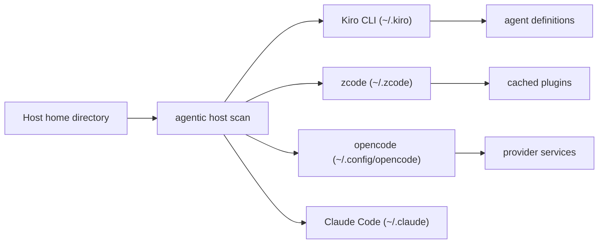

# Cataloging installed agentic CLI tools

Developers increasingly run more than one agentic coding assistant on the same
machine. A build host might have Kiro CLI, zcode, opencode, and Claude Code all
installed at once, each with its own agents, plugins, and provider settings.
The `agentic` project type gives you a Software Bill of Materials for that
layer, in the same spirit as the `ide-extension` type that inventories editor
extensions.

```shell
cdxgen -t agentic -o agentic-bom.json
```

Discovery is based on the current user's home directory rather than a
repository, so this type does not take a path argument. Because that is a
host-wide scan rather than a project scan, passing an explicit path other than
the current directory is rejected with an error rather than silently ignored,
and the command prints a notice before it scans. The scan reads the well known
home directories of each supported tool and emits one component per tool that
is present.

## What it discovers



Each installed tool becomes a `type: application` component with a
`pkg:generic/cdxgen-agentic/<tool>` package URL. A generic purl is the honest
representation here: these tools ship as self contained executables, not as a
resolvable source package or dependency graph. The `cdxgen-agentic` namespace
keeps these identifiers from colliding with unrelated `pkg:generic` components
when BOMs are merged. When a tool records its version in a declarative file,
that version is added to the purl. Tools that only report their version by
running the binary are cataloged without a version, because the scan never
executes tool binaries.

The scan also parses the configuration each tool defines and attaches it as
child components or services with dependency edges back to the tool:

- Kiro CLI agent definitions under `~/.kiro/agents/*.json`, with the model and
  redacted counts of MCP servers, tools, and allow listed tools.
- zcode plugins from the plugin cache, each with its version, license, MCP
  server count, and whether it bundles skills.
- opencode providers declared in `opencode.json` or `opencode.jsonc`, emitted as
  CycloneDX services to match how inference providers are modeled elsewhere in
  the AI inventory.

For Codex and Gemini CLI, the scan reads their MCP server declarations
(`~/.codex/config.toml` and `~/.gemini/settings.json`) to record a server count.

## Supported tools

| Tool          | Home directory scanned                                            |
| ------------- | ----------------------------------------------------------------- |
| Kiro CLI      | `~/.kiro` and the platform support directory                      |
| zcode         | `~/.zcode`                                                        |
| opencode      | `~/.config/opencode`, `~/.opencode`, `~/.local/share/opencode`   |
| Claude Code   | `~/.claude`                                                       |
| OpenAI Codex  | `~/.codex`                                                        |
| Gemini CLI    | `~/.gemini`                                                       |
| Amazon Q      | `~/.aws/amazonq`                                                  |
| Aider         | `~/.aider`                                                        |

## Safety and privacy

These directories hold sensitive material next to configuration: credential
files, session transcripts, plan histories, and telemetry. The scan is built to
stay away from all of it. It reads declarative configuration files to derive
counts and small enumerated values such as the default agent name, but it never
opens credential stores, session logs, or transcript files, and it never copies
prompt text or secret values into the BOM. The emitted properties are limited to
tool identity, versions, directory paths, and structural counts.

Local filesystem paths are redacted to a `~`-relative form (for example
`~/.kiro`) so the BOM does not carry the local user name in `cdx:agentic:home`,
`cdx:agentic:supportDir`, or `internal:SrcFile`.

Because this is a fixed host scan rather than a project scan, it does not apply
project scan filters such as `--exclude`; those options have no effect on this
path.

## Reading the result

Useful things to inspect in `agentic-bom.json`:

- `.components[] | select(.purl | startswith("pkg:generic/cdxgen-agentic/"))`
  for the installed tools and their versions.
- `cdx:agentic:mcpServerCount` on an agent or plugin to see how much MCP surface
  a tool wires in.
- `cdx:agentic:pluginCount` and `cdx:agentic:enabledPluginCount` to compare
  installed against active plugins.
- `.services[]` for opencode provider services.
- `.dependencies[]` to trace which agents, plugins, and providers belong to each
  tool.

## Related docs

- [AI-BOM Guide](AI_BOM.md)
- [MCP Inventory](MCP.md)
- [Supported Project Types](PROJECT_TYPES.md)
- [Custom Properties](CUSTOM_PROPERTIES.md)
